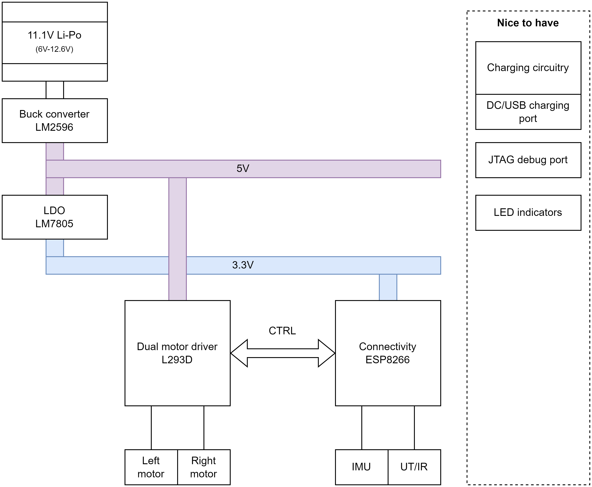

# mobrob

A mobile robot 

## Features

* Obstacle detection and avoidance
* Room mapping (explore mode?)
* Manual control (throttle + steer)
  * For example, through browser-based GUI
* Automatic navigation (A to B) (after exploring space?)
  * Complete more complex tasks like _fetch an item_?
* Charging capability preferable (e.g. MCP73831)
  * https://www.youtube.com/watch?v=GRd9uTwg7r4&ab_channel=MicroTypeEngineering
  * https://www.youtube.com/watch?v=TyaW8ZKumno&ab_channel=PlumPot

# Initial design

Datasheets for components are found in `Datasheets` folder.

* **Processor & connectivity**: ESP8266 | [datasheet](datasheets/ESP8266EX_datasheet-v4.4.pdf)
  * These values are for ESP8266EX
  * WiFi: 802.11 b/g/n Wifi, 2.4-2.5 GHz
  * Peripherals: UART / SDIO / SPI / I2C / I2S / IR Remote Control / GPIO / PWM
  * Operating voltage 3.3V (3.0-3.6V)
  * Average operating current: 80 mA
  * Around 50 kB RAM (for user, when connected to a station)
  * **Requires external SPI flash!** Up to 16 MB flash can be supported
    * Suggested: 512 kB (without OTA), 1 MB (with OTA)
  * Single core, 80 MHz
* **Dual H-bridge motor driver**: L293D | [datasheet](datasheets/L293x_datasheet.pdf)
* Power management:
  * **Battery**: 11.1V Li-Po (6-12V), (3 x 3.7V cells)
    * Price: $20-40
  * **Buck converter (12V->5V)**: LM2596 or other...
    * https://www.youtube.com/watch?v=C7-8nUU6e3E&t=2367s
  * **LDO (5V->3.3V)**: LM7805
    * https://electronics.stackexchange.com/questions/420999/use-5v-linear-regulator-and-ldo-3-3v

* **Motors & chassis**: Dual motor tank chassis (3-7V)
  * https://www.aliexpress.com/item/4000115994387.html?spm=a2g0o.order_list.0.0.21ef1802jPbMxm
  * Has slot for 4xAA batteries, could be modified to fit the rechargable 3-cell Li-Po battery.
  * Size: 9.7cm x 18.5cm x 5cm (width x length x height )
  * Motors: 130 size generic, can be replaced if necessary
  * Price: $18.50

* Sensors (both for proximity and distance, and other):
  * IMU?
  * UT/IR?
  * Others?

# Discussion

I am not sure if either ESP32 or ESP8266 come in QFP format (only in QFN, no-leads). I guess JLCPCB and others also assemble these devices so maybe this is not an issue.

## ESP32
ESP32 would be considerably better than ESP8266. It has a lot more functionality and also has 8MB of onboard flash (ESP32-S3FN8, see ESP32-S3 datasheet, p.11).

* https://www.youtube.com/watch?v=WWIy6a0T7WM&ab_channel=PlumPot
* Decoupling caps (as close of the pins as possible)
* External crystal? (see Phil's lab)
* Note the antenna/RF part!
  * No traces (or any copper) beneath the antenna part!
* Careful with differential pairs

* https://en.wikipedia.org/wiki/ESP32#ESP32-S3:
  * ESP32-WROOM-32D: PCB trace antenna, 4 MiB flash (probably preferable)
  * ESP32-WROOM-32U: U.FL socket antenna, 4 MiB flash
