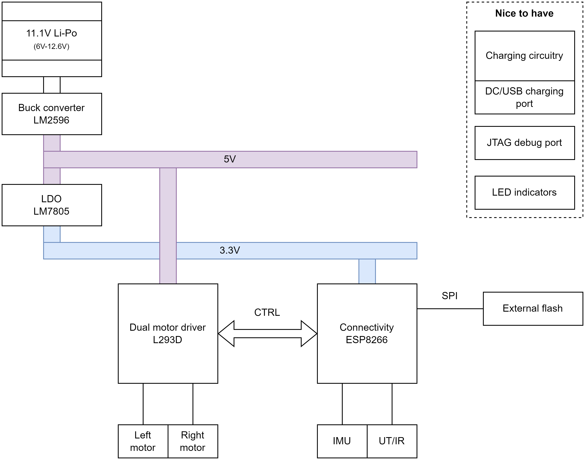

# mobrob

A mobile robot 

## Features

* Obstacle detection and avoidance
* Room mapping (explore mode?)
* Manual control (throttle + steer)
  * For example, through browser-based GUI
* Automatic navigation (A to B) (after exploring space?)
  * Complete more complex tasks like _fetch an item_?
* Charging capability preferable
  * https://www.youtube.com/watch?v=GRd9uTwg7r4&ab_channel=MicroTypeEngineering

# Initial design

Datasheets for components are found in `Datasheets` folder.

* **Processor & connectivity**: ESP8266
  * 802.11 b/g/n Wifi
  * ???
* **Dual H-bridge motor driver**: L293D
* Power management:
  * **Battery**: 11.1V Li-Po (6-12V), (3 x 3.7V cells)
    * Price: $20-40
  * **Buck converter (12V->5V)**: LM2596 or other...
    * https://www.youtube.com/watch?v=C7-8nUU6e3E&t=2367s
  * **LDO (5V->3.3V)**: LM7805
    * https://electronics.stackexchange.com/questions/420999/use-5v-linear-regulator-and-ldo-3-3v

* **Motors & chassis**: Dual motor tank chassis (3-7V)
  * https://www.aliexpress.com/item/4000115994387.html?spm=a2g0o.order_list.0.0.21ef1802jPbMxm
  * Has slot for 4xAA batteries, could be modified to fit the rechargable 3-cell Li-Po battery.
  * Size: 9.7cm x 18.5cm x 5cm (width x length x height )
  * Motors: 130 size generic, can be replaced if necessary
  * Price: $18.50

* Sensors (both for proximity and distance, and other):
  * IMU?
  * UT/IR?
  * Others?

